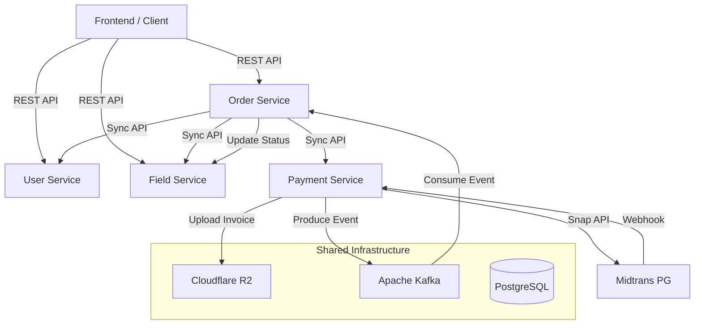

# PadelBook Backend Ecosystem

A robust, event-driven microservices ecosystem for managing Padel court bookings, payments, and user authentication. Built with Go (Golang) and optimized for high scalability and reliability.

## Architecture Diagram

The following diagram illustrates the interaction between services and infrastructure components:



## Services Description

1. **User Service (Port 8001)**
   - Manages user authentication (JWT) and profile management.
   - Handles role-based access control (Admin & Customer).
   - Provides internal service-to-service identity verification.

2. **Field Service (Port 8002)**
   - Manages Padel courts and availability schedules.
   - Automates monthly schedule generation.
   - Handles real-time slot status updates (Available, Booked).

3. **Order Service (Port 8004)**
   - Orchestrates the booking process.
   - Calculates pricing and handles order state transitions.
   - Syncs with Field Service to reserve slots and Payment Service to facilitate transactions.

4. **Payment Service (Port 8003)**
   - Integrates with Midtrans Payment Gateway (Snap API).
   - Manages payment status, webhooks, and automatic invoice generation.
   - Stores invoices in Cloudflare R2 and notifies Order Service via Kafka upon settlement.

## Technical Stack

- **Language**: Go (Golang)
- **Database**: PostgreSQL (GORM ORM)
- **Messaging**: Apache Kafka (sarama)
- **Payment Gateway**: Midtrans
- **Storage**: Cloudflare R2 (S3 Compatible)
- **Logging**: Logrus
- **API Documentation**: Swagger (swag)
- **Containerization**: Docker & Docker Compose

## System Flow (Event-Driven)

1. **Order Creation**: Order Service creates a pending order and calls Payment Service to generate a Midtrans Snap link.
2. **Payment Notification**: Midtrans hits the Payment Service Webhook.
3. **Internal Sync**: Payment Service updates its DB, uploads an invoice to R2, and produces a "Settlement" event to Kafka.
4. **Finalization**: Order Service consumes the event, updates order status to "Paid", and calls Field Service to mark the specific court slots as "Booked".

## Getting Started

### Prerequisites
- Docker & Docker Compose
- Go 1.22+ (for local development)
- Midtrans Sandbox Account
- Cloudflare R2 Bucket

### Local Setup

1. Clone the repository.
2. Setup infrastructure (Postgres & Kafka):
   ```bash
   docker-compose up -d
   ```
3. Configure `.env` files in each service directory (use `.env.example` as a template).
4. Run services:
   ```bash
   cd [service-directory]
   go run main.go serve
   ```