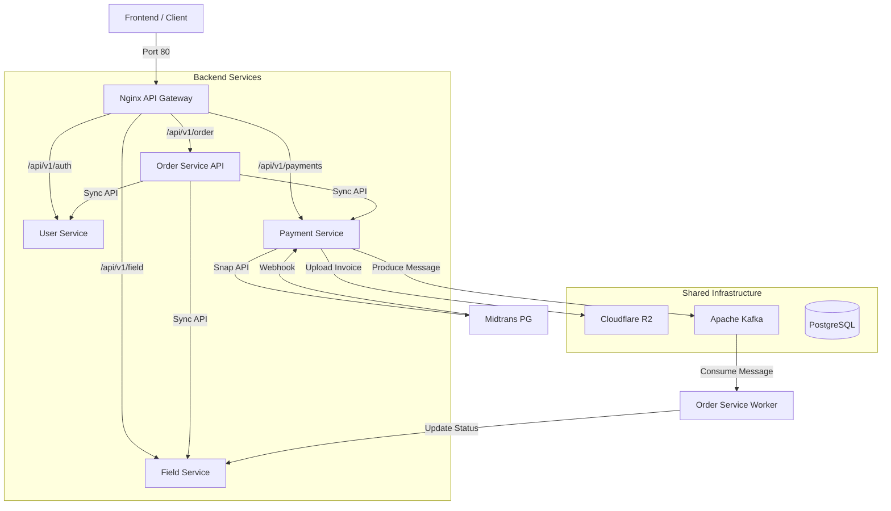

# Booking System Backend Ecosystem

A robust microservices ecosystem for managing resource bookings, payments, and user authentication. Built with Go (Golang) and optimized for scalability and modularity.

## Architecture Diagram

The following diagram illustrates the interaction between services and infrastructure components through the API Gateway:



## Services Description

The system consists of specialized microservices communicating via an **Nginx API Gateway** for external traffic, REST APIs for synchronous operations, and Apache Kafka for asynchronous synchronization.

1. User Service (Port 8080)
   - Manages user authentication (JWT) and profile management.
   - Handles role-based access control (Admin & Customer).
   - Validates internal service-to-service communication via Custom Headers.

2. Field Service (Port 8002)
   - Manages bookable resources and availability schedules.
   - Automates periodic schedule generation.
   - Handles real-time slot status updates.

3. Order Service (Port 8004)
   - **Order API**: Orchestrates the booking process and pricing.
   - **Order Worker**: Consumes Kafka messages to finalize orders and sync field availability.
   - Synchronizes with Field Service and Payment Service.

4. Payment Service (Port 8003)
   - Integrates with Midtrans Payment Gateway (Snap API).
   - Manages payment status, webhooks, and automatic invoice generation.
   - Stores invoices in Cloudflare R2 and produces Kafka messages upon payment success.

## Technical Stack

- **API Gateway**: Nginx (Centralized CORS, Rate Limiting, Routing)
- **Language**: Go (Golang)
- **Database**: PostgreSQL (GORM ORM)
- **Messaging**: Apache Kafka for asynchronous synchronization
- **Payment Gateway**: Midtrans
- **Storage**: Cloudflare R2 (S3 Compatible)
- **API Documentation**: Swagger (swag)

## System Synchronization Flow

1. **Request**: Client sends a request through Nginx (Port 80).
2. **Order Creation**: Order API creates a pending order and calls Payment Service for a transaction link.
3. **Payment Notification**: Midtrans sends a notification to Payment Service Webhook.
4. **Asynchronous Sync**: Payment Service updates its record and sends a message to Kafka.
5. **Finalization**: Order Worker consumes the message, updates order status, and triggers a status update in Field Service.

## Getting Started

### Prerequisites
- Docker & Docker Compose
- Nginx (Installed or via Docker)
- Go 1.22+
- Midtrans Sandbox Account
- Cloudflare R2 Bucket

### Local Setup

1. Clone the repository.
2. Setup infrastructure (Postgres & Kafka):
   ```bash
   docker-compose up -d
   ```
3. Configure `.env` files in each service directory.
4. Run Nginx as the API Gateway (ensure `nginx/` config is loaded).
5. Run services:
   ```bash
   # Field, User, Payment
   go run main.go serve
   
   # Order Service (Decoupled)
   go run main.go api
   go run main.go worker
   ```