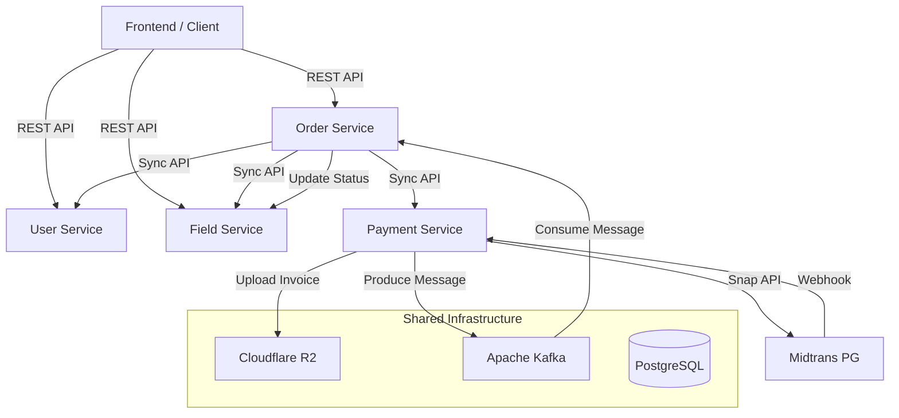

# Booking System Backend Ecosystem

A robust microservices ecosystem for managing resource bookings, payments, and user authentication. Built with Go (Golang) and optimized for scalability and modularity.

## Architecture Diagram

The following diagram illustrates the interaction between services and infrastructure components:



## Services Description

The system consists of four primary services communicating via REST APIs for synchronous operations and Apache Kafka for asynchronous synchronization.

1. User Service (Port 8001)
   - Manages user authentication (JWT) and profile management.
   - Handles role-based access control (Admin & Customer).
   - Provides internal service-to-service identity verification.

2. Resource Service (Field Service - Port 8002)
   - Manages bookable resources and availability schedules.
   - Automates periodic schedule generation.
   - Handles real-time slot status updates.

3. Order Service (Port 8004)
   - Orchestrates the booking process.
   - Calculates pricing and handles order state transitions.
   - Synchronizes with Resource Service to reserve slots and Payment Service to facilitate transactions.

4. Payment Service (Port 8003)
   - Integrates with Midtrans Payment Gateway (Snap API).
   - Manages payment status, webhooks, and automatic invoice generation.
   - Stores invoices in Cloudflare R2 and synchronizes status with Order Service via Kafka messages.

## Technical Stack

- Language: Go (Golang)
- Database: PostgreSQL (GORM ORM)
- Messaging: Apache Kafka (sarama) for background synchronization
- Payment Gateway: Midtrans
- Storage: Cloudflare R2 (S3 Compatible)
- Logging: Logrus
- API Documentation: Swagger (swag)
- Containerization: Docker & Docker Compose

## System Synchronization Flow

1. Order Creation: Order Service creates a pending order and calls Payment Service to generate a transaction link.
2. Payment Notification: The payment gateway sends a notification to the Payment Service Webhook.
3. Status Update: Payment Service updates its record, uploads the invoice to R2, and sends a message to Kafka.
4. Finalization: Order Service consumes the message, updates order status, and triggers a status update in the Resource Service to finalize the booking.

## Getting Started

### Prerequisites
- Docker & Docker Compose
- Go 1.22+ (for local development)
- Midtrans Sandbox Account
- Cloudflare R2 Bucket

### Local Setup

1. Clone the repository.
2. Setup infrastructure (Postgres & Kafka):
   ```bash
   docker-compose up -d
   ```
3. Configure .env files in each service directory.
4. Run services:
   ```bash
   cd [service-directory]
   go run main.go serve
   ```

---
Developed by Booking System Team.
